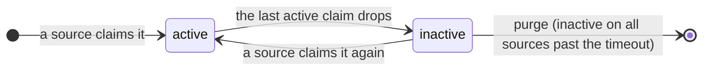
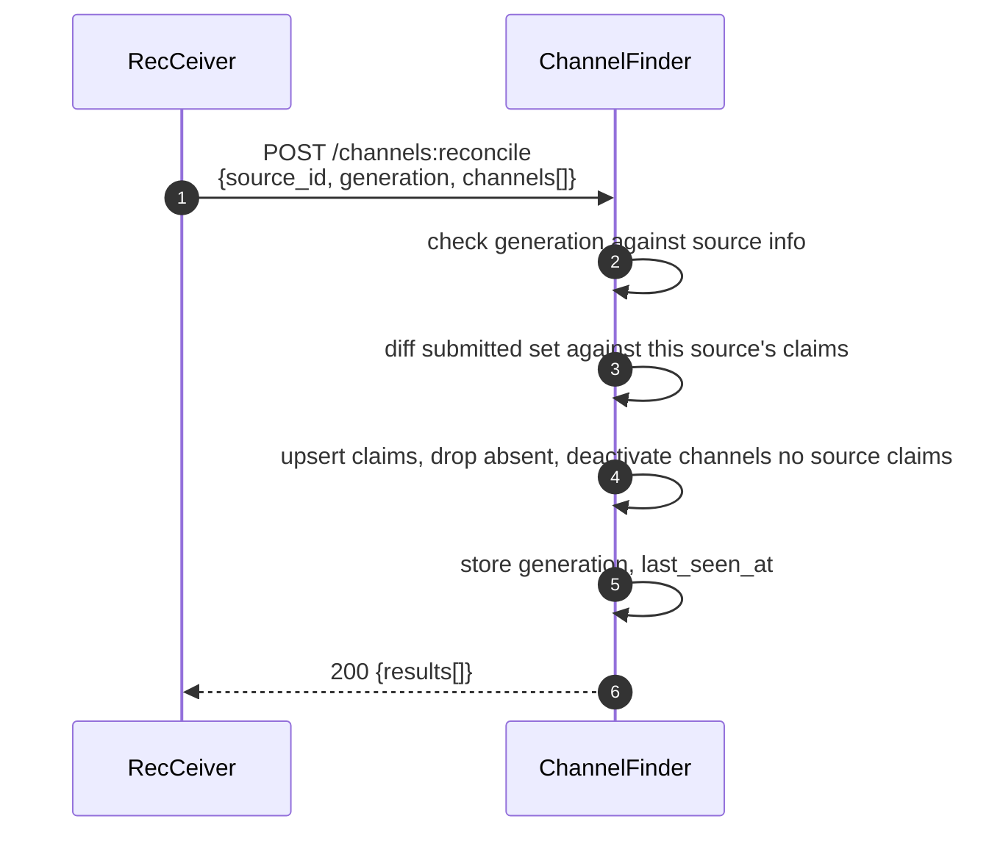
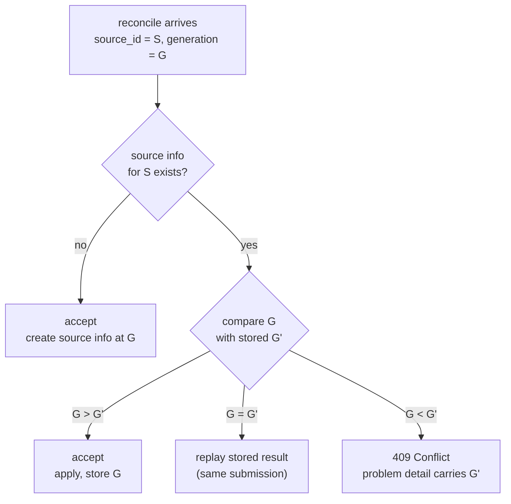

# ChannelFinder REST API conventions (v1)

Design rules for the v1 ChannelFinder HTTP API. They describe the target style,
not the current API, which predates them.

## Resources

Domain resources:

| Resource     | Path          | What                                                                          |
| ------------ | ------------- | ---------------------------------------------------------------------------- |
| channels     | `/channels`   | a unique `name`, the `sources` that claim it (active while any claim is), properties, tags |
| properties   | `/properties` | a name-value definition (`name`), attached to channels with a per-channel `value` |
| tags         | `/tags`       | a name-only label (`name`), attached to channels                             |

Operational resources — addressable machinery, not directory data:

| Resource   | Path                | What                                                                       |
| ---------- | ------------------- | -------------------------------------------------------------------------- |
| jobs       | `/jobs/{job_id}`    | a handle on a long-running async operation                                 |
| processors | `/processors`       | channel post-processors; inspect/configure here, run with `POST /channels:process` |
| sources    | `/sources`          | read-only source info of which producer claims what                            |

Service metadata, health, and metrics are **not** resources — they live on the
Spring Boot Actuator surface (`/actuator/*`), outside the versioned API.

Channel serialization:

- Properties serialize as one name→value map: `"properties": { "device": "bpm", "cell": 2, "position": 187.28 }`.
- Tags serialize as a name list: `"tags": ["active"]`.
- A property value is a **string**, an **integer**, or a **float** — fixed at the property's definition. JSON string vs. number separates text from numeric; the definition tells integer from float.
- The per-channel datum is just the value; a property name cannot appear twice.

## REST conventions

CRUD maps to HTTP methods; anything that is not CRUD is a colon-verb command
(see Commands).

| Method   | Semantics                          | Success on write                                  | Idempotent |
| -------- | ---------------------------------- | ------------------------------------------------- | ---------- |
| `GET`    | reads, never mutates               | —                                                 | yes        |
| `POST`   | creates                            | `201 Created` + full resource + `Location`        | no         |
| `PUT`    | replaces with a full representation | `200 OK` + full resource                          | yes        |
| `PATCH`  | updates part                       | `200 OK` + full resource                          | no         |
| `DELETE` | removes                            | `204 No Content`                                  | yes        |

No bare `201`/`200` — a caller never needs a follow-up `GET` for server-assigned
fields.

Status codes:

| Code  | Meaning              | When                                                                                          |
| ----- | -------------------- | --------------------------------------------------------------------------------------------- |
| `200` | OK                   | `GET`; `PUT`/`PATCH` returning the full resource                                              |
| `201` | Created              | `POST` persisting a resource; full resource + `Location`                                      |
| `202` | Accepted             | async work accepted; `Location: /jobs/{job_id}` + `Retry-After`                               |
| `204` | No Content           | `DELETE`                                                                                       |
| `400` | Bad Request          | syntax: malformed JSON, missing required field, wrong type, bad parameter format              |
| `401` | Unauthorized         | an unauthenticated write                                                                       |
| `403` | Forbidden            | an authenticated caller without the required role                                             |
| `409` | Conflict             | a reconcile whose `generation` is older than the stored one                                   |
| `422` | Unprocessable Entity | well-formed but breaks a business rule: name collision, undefined property/tag, missing channel, empty/over-large reconcile |

Never `200` with an error body — 2xx success, 4xx client fault, 5xx server fault.

Other rules:

- **Nouns in paths, plural and consistent.** `/channels`, `/properties`, `/tags` — never `/channel` or `/channels/process`.
- **Errors use [RFC 9457 Problem Details](https://www.rfc-editor.org/rfc/rfc9457)** (`type`, `title`, `status` required; `detail`, `instance` optional) with content type `application/problem+json`. Use `"about:blank"` as `type` for generic HTTP errors.
- **A command's per-item `results[]` is data, not an error body.** A `200` from `POST /channels:reconcile` means the command ran; the per-item statuses inside are its outcome. A malformed request returns `4xx` with a Problem Details body and no `results[]`. Per-item failures are never a `207 Multi-Status`.
- **Request and response are separate schemas.** A write body holds only what the caller may set; the response holds the read projection.
- **List and detail are separate representations.** A collection `GET` returns a lean summary; item `GET` and create/update responses return the full schema. Never use `null` to mean "omitted from the list"; reserve `null` for genuine optionality and list every nullable in `required`.
- **Attachment is written only through the channel.** `/properties` and `/tags` define and read the vocabulary; membership is written only through `/channels/{channel_name}/properties` and `.../tags`.
- **Two levels of nesting at most.** `/channels/{channel_name}/properties/{property_name}` is the limit.

### Single-resource writes

Plain methods handle one channel at a time, with an add-vs-replace split on the
property and tag lists:

| Method + Path                                   | Effect                                            |
| ----------------------------------------------- | ------------------------------------------------- |
| `POST /channels`                                | create one channel                                |
| `PATCH /channels/{channel_name}`                | partial update                                    |
| `DELETE /channels/{channel_name}`               | hard delete                                       |
| `PUT /channels/{channel_name}/properties`       | replace the whole property list                   |
| `PATCH /channels/{channel_name}/properties`     | add or update named properties, leaving the rest  |

### Naming

- **Lowercase kebab-case** for literal path segments.
- **`snake_case`** for path params, query params, and JSON properties both directions (`channel_name`, `next_cursor`, `total_count`).
- A filter or sort value that names a field uses the same spelling as the JSON property.
- Sort is `sort=<field>:<direction>`, direction `asc` (default) or `desc` — never a boolean flag.
- **`:camelCase`** for command segments. Standard hyphenated names for HTTP headers; never `snake_case` headers.

### Operation IDs

Every operation has a unique, stable `operationId` in `camelCase` (springdoc-openapi
maps it to the generated controller method). Use `{verb}{Resource}` or
`{verb}{Resource}{SubResource}` with a semantic verb, not the HTTP method
(`createChannel`, not `postChannel`).

| Verb                               | Use                                          |
| ---------------------------------- | -------------------------------------------- |
| `list`                             | collection `GET` returning many items        |
| `get`                              | single-resource `GET`                        |
| `query`                            | collection `GET` that is a search façade     |
| `create`                           | `POST` that persists a new resource          |
| `update`                           | `PATCH`, or `PUT` that replaces              |
| `add` / `remove`                   | attach/detach a property or tag on a channel |
| `delete`                           | `DELETE`                                      |
| `reconcile` / `process` / `cancel` | colon-verb commands                          |

| Endpoint                                             | operationId       |
| ---------------------------------------------------- | ----------------- |
| `GET /channels`                                      | `queryChannels`   |
| `POST /channels`                                     | `createChannel`   |
| `POST /channels:reconcile`                           | `reconcileChannels` |
| `DELETE /channels/{channel_name}/tags/{tag_name}`    | `removeChannelTag` |
| `DELETE /sources/{source_id}`                        | `deleteSource`    |
| `POST /jobs/{job_id}:cancel`                         | `cancelJob`       |

### Codegen

An OAS-3.0 toolchain turns array-form nullables (`type: ["string", "null"]`) into
`any`. Until a 3.1 generator is in use, write every nullable as `oneOf`:

```yaml
my_field:
  oneOf:
    - type: string
    - type: "null"
```

## Authentication

Access splits by method, not by path. Reads are open; writes need a role scoped
to the resource; `admin` where noted.

| Method class                    | Auth                | Role                                    |
| ------------------------------- | ------------------- | --------------------------------------- |
| `GET`                           | open (configurable) | —                                       |
| `PUT` / `POST` / `PATCH` / `DELETE` | required        | `channel`, `property`, `tag`, or `admin` |

- `401` for a missing/invalid credential; `403` for a valid one without the role.
- **Role is the only gate.** v1 neither exposes nor checks an `owner`.
- **Two transports: HTTP Basic and Bearer.** Bearer service tokens are recommended for machine producers like RecCeiver; Basic stays for compatibility. One scheme per request, never both. Roles come from group membership.

## Creating Properties and Tags

Properties and tags are created by `POST`ing a JSON body to the appropriate endpoint. You must create them first before they can be associated with channels. This is similar to how the current (1.9.6) RecCeiver does it.
Attempting to create a property or tag that already exists will result in a `409 Conflict` error, hence its ok to send the request and ignore the explicit error.

The only problem to note is that now properties have a `type` field that must be specified, if you configure multiple producers and one of them uses a different type for the same property name, you will need to update the type to match.
Cleanup can only be done by deleting the property or tag and recreating it with the correct type.

## Querying channels

Channel search uses plain, named, documented parameters. Multiple parameters are
**ANDed** — that conjunction of equality and glob filters is the whole
first-surface algebra (no magic characters, no `GET`-with-body).

| Parameter      | Filters on                    | Example                    |
| -------------- | ----------------------------- | -------------------------- |
| `name`         | channel name glob             | `name=SR*`                 |
| `size` / `from` | offset paging                | `size=50&from=100`         |
| `sort`         | `<field>:<direction>`         | `sort=name:asc`            |
| `state`        | lifecycle                     | `state=active` / `inactive` / `any` |
| `source_id`    | claiming source               | `source_id=recceiver-01:ioc-01` |
| `tag`          | tag presence                  | `tag=active`               |
| `prop_<name>`  | property value                | `prop_cell=2`              |
| `cursor`       | opaque full traversal         | `?cursor=…`                |
| `filter`       | RSQL (see below)              | `filter=…`                 |

The `prop_` prefix keeps property selectors distinct from `name`, `tag`, and
`state`. Negation, OR, and grouping are not in this surface — they move to RSQL.

### Pagination

Two contracts, both stateless at the API boundary:

- **Offset** (`size` + `from`) — default for interactive discovery, bounded by the store's result window.
- **Opaque `cursor`** — for full traversal (bulk export, "process all"), returned as `next_cursor`, passed back as `?cursor=…`.

The cursor is opaque, so the engine's pagination primitive never reaches the
contract. Query responses carry `{ total_count, channels[], next_cursor? }`.

### RSQL

When AND-of-filters is not enough, the richer layer is
**[RSQL](https://github.com/jirutka/rsql-parser)** in a single `filter` parameter:

```
GET /channels?filter=(prop_cell==2,prop_cell==3);tag!=disabled
```

`;` is AND, `,` is OR, and parentheses group. It is a strict superset of the
first-surface query capability. Four rules pin down semantics:

1. **Selector namespacing.** Reserve `name`, `tag`, `state` for the channel's own fields; prefix property selectors with `prop_`.
2. **Wildcards.** `*` and `?` in `==`/`!=` arguments are wildcards; matching is case-insensitive.
3. **Absence vs. value.** `prop_cell!=*` is "property absent"; `prop_cell!=2` is "has `cell`, value ≠ 2".
4. **Typed comparison.** A numeric property — integer or float — compares numerically and takes `<`/`>`/`<=`/`>=` (`prop_position>187`); a string property compares lexically and takes wildcards. The property's definition fixes which.

### Aggregating property values

**`GET /properties/{property_name}/values`** answers "what values does a property
take, and how common is each?", scoped by the same parameters as `GET /channels`.
So `GET /properties/ioc_id/values?name=SR:*` is "distinct `ioc_id`s among `SR:*`
channels." The response is a values projection, sorted and paged over the values:

```jsonc
GET /properties/ioc_id/values
{
  "total_distinct": 42,
  "values": [
    { "value": "ioc01", "count": 130 },
    { "value": "ioc02", "count": 118 }
  ],
  "next_cursor": "…"        // optional, same opaque-cursor contract as channels
}
```

`sort` orders by `value` or `count` (`sort=count:desc` for the largest groups
first); `size`/`from` and `cursor` page as for channels. The aggregation is
opaque — the engine's own aggregation, exposing only values and
counts.

## Jobs (asynchronous operations)

Some operations cannot finish in one request: a directory-wide processor sweep, or
a bulk write of tens of thousands of channels. v1 models the work as a job
resource the client submits and polls.

| Method + Path                | operationId | Auth  | Purpose                        |
| ---------------------------- | ----------- | ----- | ------------------------------ |
| `GET /jobs/{job_id}`         | `getJob`    | open  | poll a job until terminal      |
| `POST /jobs/{job_id}:cancel` | `cancelJob` | write | move a running job to canceled |

Flow:

1. The client submits the work. The server returns **`202 Accepted`** with a `Location: /jobs/{job_id}` header and a `Retry-After` hint. The body is the initial job.
2. The client polls **`GET /jobs/{job_id}`** until the job is terminal.
3. The job's `result` carries the outcome.

```jsonc
GET /jobs/{job_id}
{
  "job_id":     "…",
  "kind":       "process_channels" | "reconcile_channels" | …,
  "status":     "pending" | "running" | "succeeded" | "failed" | "canceled",
  "created_at": "…",
  "updated_at": "…",
  "progress":   { "done": 8200, "total": 12000 },   // optional
  "result":     { … },                              // present when terminal
  "error":      { … }                               // RFC 9457, on infra failure
}
```

| Field                    | Values                                                        | Notes                     |
| ------------------------ | ------------------------------------------------------------- | ------------------------- |
| `job_id`                 | string                                                        | identity                  |
| `kind`                   | `process_channels` \| `reconcile_channels` \| …               |                           |
| `status`                 | `pending` \| `running` \| `succeeded` \| `failed` \| `canceled` | terminal from `succeeded` on |
| `created_at`/`updated_at` | timestamp                                                    |                           |
| `progress`               | `{ done, total }`                                             | optional                  |
| `result`                 | object                                                        | present when terminal     |
| `error`                  | RFC 9457 Problem Details                                      | on infra failure          |

- **Opting in.** `POST /channels:process` is always async — unbounded by directory size. `POST /channels:reconcile` is synchronous unless the client sends `Prefer: respond-async` ([RFC 7240](https://www.rfc-editor.org/rfc/rfc7240)), or the submission exceeds a configured size, in which case the server answers `202` with `Preference-Applied`.
- **`succeeded` ≠ every item succeeded.** A reconcile's per-item `results[]` ships inline when synchronous and in `job.result` when async. Each failed item embeds its own Problem Details.
- **Idempotency is per command.** No `Idempotency-Key`. A reconcile's `generation` identifies the submission, so a repeat returns the original job; a repeated processor sweep is harmless.
- **Cancellation.** `POST /jobs/{job_id}:cancel` moves a running job to `canceled`. Already-applied work is not rolled back; `result` records how far it got.

## Channel state

A channel has no `state` field of its own. Whether it is **active** or
**inactive** is derived from its source links: **active** while at least one
source claims it (`sources[].active` is true), **inactive** once the last claim
drops. The representation carries only `sources[]`; a reader computes liveness
from it, and the `state=` query parameter is sugar over the same rule.

```jsonc
GET /channels/SOME:AI          // one source, claiming inactive → the channel is inactive
{
  "name": "SOME:AI",
  "updated_at": "2026-07-15T09:24:56Z",
  "sources": [
    { "source_id": "recceiver-01:ioc-01", "active": false, "updated_at": "2026-07-15T09:24:56Z" }
  ],
  "properties": { "cell": 2, "position": 187.28 },
  "tags": ["active"]
}
```



An inactive channel is soft-deleted: the record stays, and the next reconcile that
mentions it brings it back with its metadata intact. `DELETE /channels/{channel_name}`
is still a hard delete.

| Field / rule                    | Meaning                                                                                                              |
| ------------------------------- | ------------------------------------------------------------------------------------------------------------------- |
| `updated_at`                    | last time the channel's **metadata** (properties, tags) changed; not moved by a claim flip or a no-op reconcile     |
| reads default-exclude inactive  | `GET /channels` returns active only unless asked (`state=inactive`, `state=any`); `total_count` counts the filtered set; the values endpoint inherits the default |
| `pvStatus` reserved             | the v0 lifecycle property; writing it via any `/properties` path is `422` and it never appears in the `properties` map. A v0 write of it is applied as a claim change (see v0 coexistence); query liveness with `state=`, not `prop_pvStatus=` |
| liveness = OR of claims         | derived `active` while ≥1 source claims it active, `inactive` once the last drops; each reconcile changes only its own claim, never a channel-level flag |
| `sources[]` entry               | `{ source_id, active, updated_at }`; the link's `updated_at` stamps when that source last changed its claim (reconcile refresh/drop, or scope retirement) |
| metadata is shared              | properties/tags belong to the channel; |
| identity is `name`              | `sources[]` hangs off the channel, never part of the key; a reader resolves a PV by name and gets one answer         |
| purge is configuration          | a channel inactive on *all* sources past the configured timeout is hard-deleted, measured from the last link flip (not the metadata `updated_at`); a site setting, no request triggers it |

## Bulk writes: reconcile

A producer pushes what it currently serves and CF works out what changed. That is
not one CRUD operation, so it is a colon-verb command. **`POST /channels:reconcile`**
takes one desired-state document, scoped to one producer:

```jsonc
POST /channels:reconcile
{
  "source_id":  "recceiver-01:ioc-01",
  "generation": 1768470296000,
  "channels": [
    { "name": "SR:C01", "properties": { "cell": 1 }, "tags": ["active"] },
    { "name": "SR:C02", "properties": { "cell": 2 }, "tags": [] },
    { "name": "SR:C03", "properties": { "cell": 3 } }
  ]
}
```



- **`source_id` scopes the submission** — a producer-supplied name for a set of channels that appear and disappear together, **stable across restarts** (name the producer, not a connection). **The producer chooses it**; an optional form is `recceiver_id:ioc_name` (e.g. `recceiver-01:ioc-01`), should be unique to a given receiver/ioc pair and persistent across restarts/reconnections of IOCs. Optional: if omitted, CF derives a fallback from the request host and the ioc name or iocid property. CF records the claim in each channel's `sources[]` and diffs against it.
- **Channels this source claims but no longer mentions have their claim dropped** (`active: false`); the channel goes `inactive` only if no other source still claims it. Nothing outside the scope is touched.
- **Per-item, not transactional.** Each item is applied and reported independently in one `results[]`, keyed by channel `name`. A `200` (or `job.succeeded`) means the reconcile ran, not that every item passed. A failed item is not deactivated.
- **Sync by default, async on request** — see Jobs.

```jsonc
{ "results": [
  { "name": "SR:C01", "status": 201 },
  { "name": "SR:C03", "status": 422,
    "error": { "type": "about:blank", "title": "Unprocessable Entity",
               "status": 422, "detail": "property 'cell' is not defined" } },
  { "name": "SR:C99", "status": 200, "active": false }
] }
```

### Safety valve

An empty `channels[]` deactivates every channel in the scope, and a producer that
starts before its configuration loads sends exactly that, in earnest.

| Trigger                                                        | Result                                            |
| ------------------------------------------------------------- | ------------------------------------------------- |
| Empty desired set (`channels[]` = `[]`)                       | rejected unless an explicit confirmation flag is set |
| Deactivates more than a configured fraction of a scope        | rejected the same way                             |

Both are `422` with a Problem Details body naming the count.

## Sources

CF keeps one lightweight info per source. Each channel lists
its claiming sources in `sources[]`, so a source's current set — and its channel
count — is a query over that field, not a stored list.

```jsonc
{
  "source_id":     "recceiver-01:ioc-01",
  "state":         "active",
  "generation":    1768470296000,
  "last_seen_at":  "2026-07-15T09:24:56Z"
}
```

- `last_seen_at` is per source, not per channel. "When was this channel last seen?" — an active channel takes the most recent `last_seen_at` among the sources that claim it active; an inactive one takes its most recent link `updated_at`.
- A source's **`state`** is derived from its links: `active` while it holds at least one active link, `inactive` once all its links are inactive.

| Method + Path                 | operationId   | Auth    | Purpose                                                     |
| ----------------------------- | ------------- | ------- | ---------------------------------------------------------- |
| `GET /sources`                | `listSources` | open    | source info; default-excludes inactive (`state=inactive`/`any` to include) |
| `GET /sources/{source_id}`    | `getSource`   | open    | one source info                                                 |
| `DELETE /sources/{source_id}` | `deleteSource` | `admin` | retire the scope (below); `204`, or a job (`202`) when large; idempotent |

### Retiring a source

A decommissioned producer never reconciles again, so its claims would otherwise
stand forever and hold their channels `active`. `DELETE /sources/{source_id}`
force retires the scope by flipping every one of the source's links to `active: false`.
A source automatically goes into `inactive` state when all its links are inactive.

- the source goes `inactive` (all its links are now inactive);
- after `source_inactive_timeout`, the source info is deleted.

### The generation guard

`generation` orders a source's submissions, so a slow or duplicated reconcile
cannot undo a newer one. It is **epoch milliseconds, as an integer**, taken when
the producer snapshots its set — a wall clock, not a counter that would reset on
restart. **Generations are compared only within one `source_id`**, so a fast
clock on one source can never "win" against another; skew only matters if two
physical clocks feed the same `source_id`.



Equal generations **replay** rather than conflict: a producer whose request timed
out cannot otherwise tell "already applied" from "lost the race", so an identical
resubmission returns the original result. A `409` carries the stored generation so
a producer that is behind can resynchronise:

```jsonc
{
  "type":   "about:blank",
  "title":  "Conflict",
  "status": 409,
  "detail": "generation 1768470100000 is older than the stored generation for source 'recceiver-01:ioc-01'",
  "current_generation": 1768470296000
}
```

So a producer's own clock need only be roughly monotonic for *its* scope. To
stay self-correcting under skew (an HA failover or a restart on a slower host,
where a genuinely-newer snapshot could carry a lower number), a producer derives
each generation as:

```
generation = max(now_ms, last_current_generation + 1)
```

seeding `last_current_generation` from the most recent `409`'s
`current_generation`. This turns "fast clock wins forever" into "fast clock wins
this round; the loser re-syncs on its next snapshot."

Two redundant producers sharing one `source_id` is a deliberate choice, not a
bug: they submit the same desired state, so overwriting is harmless, and the
rule above keeps them from starving each other. Skew across *different*
`source_id`s never matters, since generations compare only within a source.

## Processors

Processors are server-side post-processors that react to channel metadata. The
Archiver Appliance processor (`AAChannelProcessor`) registers a channel for
archiving when it carries the right `archive`/`archiver` properties, and pauses it
when the channel goes `inactive`.

Running the processors is the `POST /channels:process` command (always async), not
a write under `/processors`. `/processors` itself is inspect plus a small config
surface:

| Method + Path                        | operationId      | Auth    | Purpose                                        |
| ------------------------------------ | ---------------- | ------- | ---------------------------------------------- |
| `GET /processors`                    | `listProcessors` | open    | registered processors with info and config     |
| `GET /processors/{processor_name}`   | `getProcessor`   | open    | one processor's detail                         |
| `PATCH /processors/{processor_name}` | `updateProcessor` | `admin` | partial config update, chiefly toggling on/off |

```jsonc
PATCH /processors/aa
{ "enabled": false }
```

`enabled` is state on the noun, so it is a `PATCH`, not a `PUT .../enabled` sub-path.

## Commands

Two operations are genuinely actions, not single-resource mutations — the one
place a colon-verb command fits. Colon-verbs signal a mutation or side effect;
never use them for reads. Both can run over the whole directory, so both can
return a job.

| Command                    | operationId         | Purpose                                     |
| -------------------------- | ------------------- | ------------------------------------------- |
| `POST /channels:reconcile` | `reconcileChannels` | apply a producer's desired state for one scope |
| `POST /channels:process`   | `processChannels`   | run the processors over a set of channels   |

## Observability

Service metadata, backend status, health, and metrics are not domain resources and
stay out of the versioned API. Spring Boot Actuator serves them, already enabled
(`management.endpoints.web.exposure.include=prometheus, metrics, health, info`).
These follow Actuator's own conventions — no `snake_case`, `operationId`s, or
Problem Details.

| Endpoint                                   | Purpose                                  |
| ------------------------------------------ | ---------------------------------------- |
| `GET /actuator/health`                     | liveness/readiness and backend reachability |
| `GET /actuator/info`                       | service name, version, build metadata    |
| `GET /actuator/metrics`, `/actuator/prometheus` | metrics scrape                      |

## v0 coexistence

v1 reads v0 conventions and maps them onto the new model, so a v0 producer keeps
working through cutover:

| v0 construct               | Maps to      | Behavior                                                                                                  |
| -------------------------- | ------------ | -------------------------------------------------------------------------------------------------------- |
| `pvStatus` property        | claim `active` | v0 writes to `pvStatus` are applied to that producer's claim — flipping its link `active` and stamping the link `updated_at`, not the channel's metadata `updated_at`. Channel liveness then follows from the claims |
| `iocname`, `iocid` property           | `source_id`  | CF reads `iocname` and maps it to the channel's `source_id` and falls back to `iocid` if `iocname` is not available, so scope and claims work before that producer moves to reconcile |
| numeric property (typed)   | string on read | a v0 read of an integer-/float-typed property sees its string form; a v0 write of a numeric string is parsed into the integer or float. Numeric typing never breaks a v0 client |

## Soft rules

- Prefer `PATCH` over `PUT` for partial edits.
- Query parameters filter lists; they never carry a body's worth of structure when a body is the honest representation.
