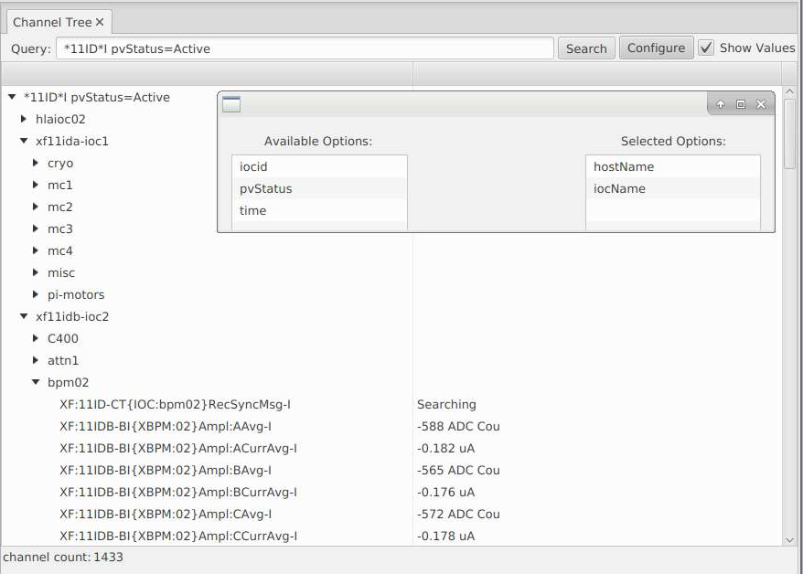

Introduction
============

The directory data consists of set of Channels, with an arbitrary set of Properties(name-value pairs), and an arbitrary set of
Tags(names).
These channels can be then queried based on the channel name, property value and tags

e.g.

XF:31\*IDA\*&axis=4\*&tag=sys.XF:31

Will return all pvs from the insertion device 31 belonging to axis 4 with tag sys.XF:31

Example Data:

+----------------------------------------------------------------------------------------+
| **Channels**                                                                           |
+----------------+-----------------------------------+-----------------------------------+
| *name*         |     SR:C02-MG:G04A{HFCor:FM1}     |     SR:C02-MG:G04A{VFCor:FM1}     |
+                +-----------------+-----------------+-----------------+-----------------+
|                |      Fld-I      |      Fld-SP     |      Fld-I      |      Fld-SP     |
+----------------+-----------------+-----------------+-----------------+-----------------+
+----------------+-----------------------------------------------------------------------+
| **Properties** |                                                                       |
+                |                                                                       +
| *name*         | *value*                                                               |
+----------------+-----------------+-----------------+-----------------+-----------------+
| *handle*       |     READBACK    |     SETPOINT    |     READBACK    |    SETPOINT     |
+----------------+-----------------+-----------------+-----------------+-----------------+
| *elemName*     |             FXM1G4C02A            |            FYM1G4C02A             |
+----------------+-----------------------------------+-----------------------------------+
| *elemType*     |               HFCOR               |               VFCOR               |
+----------------+-----------------------------------+-----------------------------------+
| *elemField*    |                 x                 |                 y                 |
+----------------+-----------------------------------+-----------------------------------+
| *devName*      |                               FM1G4C02A                               |
+----------------+-----------------------------------------------------------------------+
| *sEnd*         |                                65.5222                                |
+----------------+-----------------------------------------------------------------------+
| *cell*         |                                  C02                                  |
+----------------+-----------------------------------------------------------------------+
| *girder*       |                                  G4                                   |
+----------------+-----------------------------------------------------------------------+
| *symmetry*     |                                  A                                    |
+----------------+-----------------------------------------------------------------------+
| *length*       |                                0.044                                  |
+----------------+-----------------------------------+-----------------------------------+
| *name*         |                263                |                264                |
+----------------+-----------------------------------+-----------------------------------+
+----------------+-----------------------------------------------------------------------+
| **Tags**                                                                               |
+----------------+-----------------+-----------------+-----------------+-----------------+
|                |       eget      |       eput      |       eget      |      eput       |
+----------------+-----------------+-----------------+-----------------+-----------------+
|                |                 x                 |                 y                 |
+----------------+-----------------------------------+-----------------------------------+
|                |                                sys:SR                                 |
+----------------+-----------------------------------------------------------------------+

Example Application:

Using the Properties and Tags from the example data above, it is possible for applications and tools
to create high level abstractions (engineering, physics, etc..) on top the the epics pvs.

We see once such use case where the high level physic application creates a "corrector" object. The readback, setpoint, and
other controls are determined via queries to channelfinder.

 .. code-block:: python
	 
  # Create a Corrector object with device name FM1G4C02A,
  # the associated epics channels are retrieved from channelfinder
  # by searching for all pvs with a property "deviceName" which is equal to "FM1G4C02A"
  
  corrector = Corrector(deviceName="FM1G4C02A")
  ## channels = cf.find(deviceName="FM1G4CO2A")
  
  xPos, yPos = corrector.getPositions()
  ## The getPosition function will search for the x and y field channels associated with this device
  ## and read their values using caget
  ## xPosPv = cf.find([(deviceName,"FM1G4CO2A"), (elemField, "x")])
  ## yPosPv = cf.find([(deviceName,"FM1G4CO2A"), (elemField, "y")])
  ## caget(xPosPv ) and caget(yPosPv )
  
  corrector.setPositions(xPos=1.23, yPos=3.21)
  ## The setPoistion function will search for the x and y position setpoint pvs
  ## and write to them using caput
  ## caput("SR:C02-MG:G04A{HFCor:FM1} Fld-SP", 1.23) 
  ## caput("SR:C02-MG:G04A{VFCor:FM1} Fld-SP", 3.21)

The Channel Tree View allows to create an hierarchical view of the channels by using properties and their values.
It groups the channels returned by a query based on the value of the properties selected.

Based on the order of the selected properties, all channels with a same property value are grouped under the same node.
In the image above we see the channels ordered by the value of the properties ``hostName`` and then ``iocName``

Data Management
---------------
The utility of the ChannelFinder Directory service is directly related to the quality of the data. 
Ensuring that the list of channels in the directory accurately reflects the current state of the EPICS IOC’s 
is essential to ensure the user queries resolve to a valid set of channels.

Keeping the channels list up to date would require.  
 * Addition of new channels when new PV’s are added to IOC
 * Deletion or Tagging of channels where the associated PV has been removed from the IOC
 * Following the transition of PV's to different IOC's or IOC's to different hosts

These and other requirements can be addressed with the use of RecSync.

 .. image:: images/recsync-arch.png
RecSync Architecture

RecSync is a pair of software modules:
 1. reccaster - a module that is added to (compiled into) the IOC (similar to e.g. autosave, calc etc.)
 which listens to announcements from the recceiver service on a corresponding subnet. Reccaster informs the service of the state of the IOC
 and the list of PVs contained in that IOC, plus any defined EPICS environment variables.
 
 2. recceiver - a service which collects reccaster reports on the state of IOCs within the corresponding subnet and updates
 ChannelFinder (a directory service for EPICS channels) with the list of PVs hosted by those IOCs along with a set of properties representing the
 state and other mets data associted with the IOC.

Example of recsync properties:

+----------------------------------------------------------------------------------------+
| **Channels**                                                                           |
+----------------+-----------------------------------+-----------------------------------+
| *name*         |     SR:C02-MG:G04A{HFCor:FM1}     |     SR:C02-MG:G04A{HFCor:FM1}     |
+                +-----------------+-----------------+-----------------+-----------------+
|                |      Fld-I      |      Fld-SP     |      Fld-I      |      Fld-SP     |
+----------------+-----------------+-----------------+-----------------+-----------------+
| **Properties** |                                                                       |
+----------------+-----------------------------------------------------------------------+
| *hostName*     |                             ps-psioc-c02                              |
+----------------+-----------------------------------------------------------------------+
| *iocName*      |                                ps-C02A                                |
+----------------+-----------------------------------------------------------------------+
| *status*       |                                Active                                 |
+----------------+-----------------------------------------------------------------------+
| *time*         |                      2021-04-23T13:04:25-04:00                        |
+----------------+-----------------------------------------------------------------------+

RecSync Benefits:
Running together, ChannelFinder, recceiver, and a collection of reccaster-enabled IOCs provide various benefits, such as:

1. The directory service provides an easily searchable list of all the PV's on the controls infrastructure.
 One such use case of this directory is to create reports on the PV naming standards compliance.

2. ChannelFinder service populated with actual data provides advanced diagnostics and debugging capabilities.
 When you cannot connect to a PV you can now look up the last time the PV was active, the host and the IOC that was last serving this PV from ChannelFinder. If defined by the IOC, the information also includes the name and email of the IOC engineer to facilitate contacting them.

3. Properly populated ChannelFinder data is useful for creating device, geographical, and other groups of channels.
 E.g. for accelerator applications, the Accelerator Physics High Level Applications module (APHLA) used ChannelFinder to create abstract physics representations out of machine PVs (e.g. a collection of magnet setpoints).

4. Phoebus can use ChannelFinder data to auto complete PV names so there is no need to memorize an exact PV name.

Data Processor
--------------

ChannelFinder service allows the registration of Processors using the java SPI framework. Site specific installations of ChannelFinder can include multiple actions/processes which are performed everytime a channel is created or updated.

e.g. The AA processor, checks if the newly created channel includes a property called *archive*, if present it uses the value of this property and adds this channel to the archiver appliance to begin archiving.